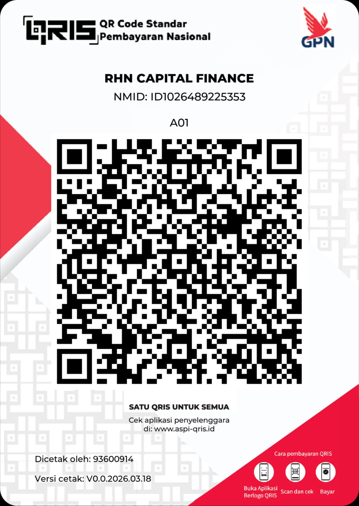

<html lang="id">
<head>
    <meta charset="UTF-8">
    <meta name="viewport" content="width=device-width, initial-scale=1.0">
    <title>Sistem Kasir RHN STORE - QRIS Edition</title>
    
    
</head>
<body>

    

        

            

                

                    <h1>🛒 RHN STORE POS</h1>
                    
00:00:00

                

                

                    <input type="text" id="barcodeInput" class="barcode-input" placeholder="Scan / Ketik Kode..." autofocus autocomplete="off">
                    <button class="btn-scan" onclick="bukaKamera()">📷 Scan Kamera</button>
                    <button class="btn-add" onclick="bukaModalTambah()">➕ Tambah Barang</button>
                

            

            

                

                <button class="btn-close-cam" onclick="tutupKamera()">Tutup Kamera Scanner</button>
            

            

        

        

            

                <h2>Rincian Transaksi</h2>
                <button class="btn-clear" onclick="kosongkanKeranjang()">🗑️ Batal</button>
            

            
            

                
Belum ada barang

            

            

                
SubtotalRp 0

                
PPN (11%)Rp 0

                
TOTALRp 0

                

                    
💵 Tunai

                    
📱 QRIS / E-Wallet

                

                

                    <input type="number" id="paymentInput" class="payment-input" placeholder="Nominal Uang (Rp)">
                

                
                

                    Scan QRIS Asli RHN CAPITAL FINANCE:
                    
                    NMID: ID1026489225353
                    

                        Total yang harus dibayar: 
                        Rp 0
                    

                    *Pastikan pembeli mengisi nominal di atas dengan benar
                

                
                <button class="btn-pay" onclick="prosesPembayaran()">PROSES BAYAR & CETAK</button>
            

        

    

    

        

            <h2 id="modalTitle" style="color: var(--success);">✅ TRANSAKSI SUKSES</h2>
            
Uang Kembalian Pelanggan:

            
Rp 0

            <button class="btn-close-modal" onclick="tutupModalDanLanjut()">Lanjut Transaksi Berikutnya</button>
        

    

    

        

            <h2 style="color: var(--primary);">➕ Tambah Barang</h2>
            
Masukkan detail barang baru di bawah ini

            
            <input type="text" id="inputKodeBaru" class="payment-input input-kiri" placeholder="Kode Barang / Barcode">
            <input type="text" id="inputNamaBaru" class="payment-input input-kiri" placeholder="Nama Barang / Makanan">
            <input type="number" id="inputHargaBaru" class="payment-input input-kiri" placeholder="Harga Jual (Rp)">
            
            <button class="btn-pay" style="margin-bottom: 10px; margin-top: 10px;" onclick="simpanBarangBaru()">SIMPAN BARANG</button>
            <button class="btn-close-modal" onclick="tutupModalTambah()">Batal</button>
        

    

    

    
</body>
</html>
